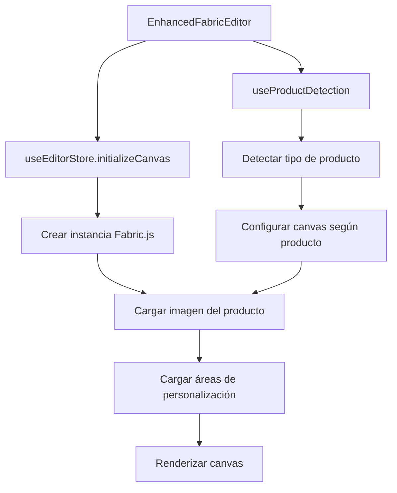
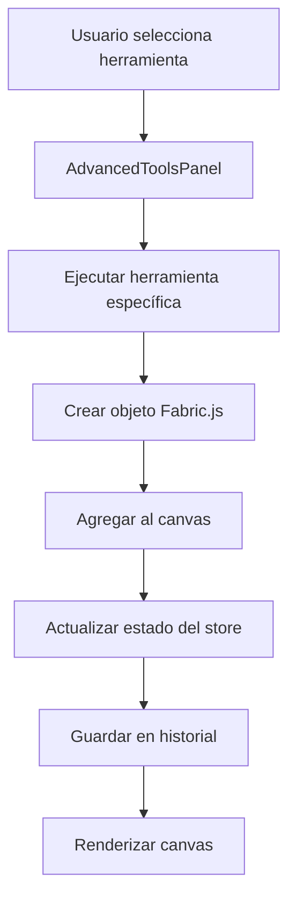
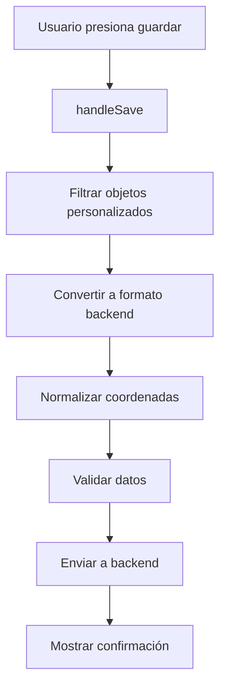

# README Técnico - FabricDesignEditor

## Índice
1. [Visión General](#visión-general)
2. [Arquitectura del Sistema](#arquitectura-del-sistema)
3. [Componentes Principales](#componentes-principales)
4. [Flujo de Datos](#flujo-de-datos)
5. [Gestión de Estado](#gestión-de-estado)
6. [Integración con Backend](#integración-con-backend)
7. [Herramientas y Funcionalidades](#herramientas-y-funcionalidades)
8. [Optimizaciones de Rendimiento](#optimizaciones-de-rendimiento)
9. [Manejo de Errores](#manejo-de-errores)
10. [Guía de Desarrollo](#guía-de-desarrollo)

---

## Visión General

El **FabricDesignEditor** es un editor de diseño gráfico avanzado construido sobre **Fabric.js** que permite crear diseños personalizados para productos de sublimación. El sistema está diseñado para ser modular, escalable y altamente optimizado para el rendimiento.

### Características Principales
- **Editor de Canvas**: Basado en Fabric.js 5.3.0 con optimizaciones personalizadas
- **Gestión de Estado**: Zustand con middleware Immer para estado inmutable
- **Detección de Productos**: Sistema inteligente que adapta la interfaz según el tipo de producto
- **Formas Vectoriales**: Integración híbrida entre Konva.js y Fabric.js
- **Historial Completo**: Sistema de undo/redo con persistencia
- **Exportación Avanzada**: Múltiples formatos y configuraciones

---

## Arquitectura del Sistema

### Estructura de Directorios
```
FabricDesignEditor/
├── components/           # Componentes UI especializados
│   ├── AdvancedToolsPanel.jsx
│   ├── ColorPicker.jsx
│   ├── ExportManager.jsx
│   ├── FontSelector.jsx
│   ├── ImageUploader.jsx
│   ├── KonvaShapesModal.jsx
│   └── ParticleBackground.jsx
├── config/              # Configuraciones del sistema
│   ├── colors.js
│   ├── editor.js
│   ├── products.js
│   └── tools.js
├── hooks/               # Hooks personalizados
│   ├── useDesignHistory.js
│   ├── useFabricCanvas.js
│   ├── useFontManager.js
│   └── useProductDetection.js
├── stores/              # Gestión de estado
│   └── useEditorStores.jsx
├── styles/              # Estilos y temas
│   └── glassmorphism.js
├── utils/               # Utilidades y conversores
│   └── KonvaFabricConverter.js
├── editorTools.js       # Herramientas del editor
└── EnhancedFabricEditor.jsx  # Componente principal
```

### Patrones de Diseño Utilizados
- **Store Pattern**: Zustand para gestión de estado global
- **Hook Pattern**: Hooks personalizados para lógica reutilizable
- **Factory Pattern**: Creación de objetos Fabric.js
- **Converter Pattern**: Conversión entre formatos Konva/Fabric
- **Observer Pattern**: Eventos del canvas y notificaciones

---

## Componentes Principales

### 1. EnhancedFabricEditor.jsx
**Componente principal del editor**

```javascript
// Props principales
{
  product: Object,           // Datos del producto
  initialDesign: Object,     // Diseño inicial a cargar
  onSave: Function,         // Callback de guardado
  onClose: Function,        // Callback de cierre
  onBack: Function,         // Callback de navegación
  isOpen: Boolean          // Estado de visibilidad
}
```

**Responsabilidades:**
- Inicialización del canvas de Fabric.js
- Carga de imagen del producto y áreas de personalización
- Gestión de la interfaz de usuario principal
- Coordinación entre componentes
- Manejo de eventos globales

### 2. useEditorStores.jsx
**Store principal con Zustand**

```javascript
// Estado principal
{
  canvas: fabric.Canvas,           // Instancia del canvas
  isCanvasInitialized: Boolean,    // Estado de inicialización
  selectedObjects: Array,          // Objetos seleccionados
  activeTool: String,              // Herramienta activa
  objectHistory: Array,            // Historial de cambios
  vectorShapes: Array,             // Formas vectoriales
  // ... más estados
}
```

**Funciones Clave:**
- `initializeCanvas()`: Inicializa el canvas con configuración
- `safeRender()`: Renderizado seguro con validación de contexto
- `saveToHistory()`: Guarda estado en historial
- `addVectorShape()`: Agrega formas vectoriales
- `loadElementsFromBackend()`: Carga elementos desde backend

### 3. KonvaFabricConverter.js
**Conversor híbrido Konva/Fabric**

```javascript
// Conversión principal
KonvaFabricConverter.fabricToBackend(fabricObject, areaId, canvasDimensions)
KonvaFabricConverter.backendToFabric(backendElement, canvasDimensions)
```

**Tipos de Conversión:**
- **Formas Vectoriales**: Paths SVG complejos
- **Formas Básicas**: Rectángulos, círculos, triángulos
- **Texto**: Objetos de texto con estilos
- **Imágenes**: Objetos de imagen con transformaciones

---

## Flujo de Datos

### 1. Inicialización


### 2. Creación de Elementos


### 3. Guardado de Diseño


---

## Gestión de Estado

### Store Principal (Zustand + Immer)
```javascript
const useEditorStore = create(
  subscribeWithSelector(
    immer((set, get) => ({
      // Estado del canvas
      canvas: null,
      isCanvasInitialized: false,
      
      // Herramientas
      activeTool: 'select',
      toolProperties: { /* ... */ },
      
      // Objetos
      selectedObjects: [],
      allObjects: [],
      
      // Historial
      objectHistory: [],
      currentHistoryIndex: -1,
      
      // Formas vectoriales
      vectorShapes: [],
      vectorEditMode: false,
      
      // Acciones
      initializeCanvas: (canvasElement, config) => { /* ... */ },
      safeRender: () => { /* ... */ },
      saveToHistory: (description) => { /* ... */ },
      // ... más acciones
    }))
  )
);
```

### Selectores Optimizados
```javascript
// Selectores para evitar re-renders innecesarios
export const useCanvasState = () => useEditorStore((state) => ({
  canvas: state.canvas,
  isInitialized: state.isCanvasInitialized,
  config: state.canvasConfig
}));

export const useToolsState = () => useEditorStore((state) => ({
  activeTool: state.activeTool,
  properties: state.toolProperties,
  setActiveTool: state.setActiveTool,
  updateToolProperties: state.updateToolProperties
}));
```

---

## Integración con Backend

### Formato de Datos
```javascript
// Estructura de elemento para backend
{
  type: 'path' | 'text' | 'image' | 'rect' | 'circle' | 'triangle',
  areaId: String,                    // ID del área de personalización
  konvaAttrs: {
    x: Number,                       // Posición X normalizada (800x600)
    y: Number,                       // Posición Y normalizada
    width: Number,                   // Ancho normalizado
    height: Number,                  // Alto normalizado
    rotation: Number,                // Rotación en grados
    scaleX: Number,                  // Escala X
    scaleY: Number,                  // Escala Y
    opacity: Number,                 // Opacidad (0-1)
    fill: String,                    // Color de relleno
    stroke: String,                  // Color de borde
    strokeWidth: Number,             // Grosor del borde
    
    // Propiedades específicas por tipo
    ...(type === 'text' && {
      fontSize: Number,
      fontFamily: String,
      fontWeight: String,
      textAlign: String,
      text: String
    }),
    
    // Propiedades vectoriales
    ...(isVectorShape && {
      shapeType: String,
      pathData: String,
      vectorParams: Object,
      isVectorShape: true
    })
  },
  metadata: {
    originalFileName: String,
    fileSize: Number,
    source: String,
    tags: Array
  }
}
```

### Normalización de Coordenadas
```javascript
// Las coordenadas se normalizan a 800x600 para consistencia
const normalizedCoords = CoordinateConverter.toStandard({
  x: fabricObject.left,
  y: fabricObject.top,
  width: bounds.width,
  height: bounds.height
}, canvasDimensions);
```

---

## Herramientas y Funcionalidades

### 1. Herramientas de Contenido
```javascript
// Herramienta de texto
EDITOR_TOOLS.text = {
  execute: (canvas, productType, options) => {
    const textObject = new fabric.Text(options.text, {
      fontSize: options.fontSize || 24,
      fontFamily: options.fontFamily || 'Arial',
      fill: options.fill || '#000000',
      // ... más propiedades
    });
    canvas.add(textObject);
    return textObject;
  }
};
```

### 2. Herramientas de Formas
```javascript
// Herramienta de formas básicas
EDITOR_TOOLS.shapes = {
  execute: (canvas, productType, options) => {
    const shapeType = options.shapeType || 'rectangle';
    let shape;
    
    switch (shapeType) {
      case 'rectangle':
        shape = new fabric.Rect({ /* ... */ });
        break;
      case 'circle':
        shape = new fabric.Circle({ /* ... */ });
        break;
      // ... más formas
    }
    
    canvas.add(shape);
    return shape;
  }
};
```

### 3. Formas Vectoriales
```javascript
// Creación de formas vectoriales complejas
const vectorShape = new fabric.Path(pathData, {
  left: x,
  top: y,
  fill: color,
  stroke: strokeColor,
  data: {
    konvaAttrs: {
      isVectorShape: true,
      shapeType: 'star',
      pathData: pathData,
      vectorParams: params
    }
  }
});
```

---

## Optimizaciones de Rendimiento

### 1. Renderizado Seguro
```javascript
safeRender: () => {
  if (!state.canvas?.lowerCanvasEl) return;
  
  const context = state.canvas.lowerCanvasEl.getContext('2d');
  if (context && typeof context.clearRect === 'function') {
    state.canvas.requestRenderAll();
  } else {
    // Reintentar después de delay
    setTimeout(() => {
      if (state.canvas?.lowerCanvasEl) {
        state.canvas.requestRenderAll();
      }
    }, 100);
  }
}
```

### 2. Debouncing en Historial
```javascript
saveToHistory: debounce((description = 'Cambio') => {
  // Guardar estado con debounce de 300ms
}, 300)
```

### 3. Throttling en Eventos
```javascript
const handleZoom = useCallback(throttle((direction) => {
  // Manejar zoom con throttling de 100ms
}, 100), [canvas]);
```

### 4. Lazy Loading de Fuentes
```javascript
// Carga asíncrona de fuentes de Google
const loadGoogleFont = async (fontFamily) => {
  if (!document.fonts.check(`16px ${fontFamily}`)) {
    await fontService.loadGoogleFont(fontFamily);
  }
};
```

---

## Manejo de Errores

### 1. Validación de Canvas
```javascript
// Verificar que el canvas esté completamente inicializado
if (!canvas || !canvas.lowerCanvasEl) {
  console.warn('Canvas no disponible');
  return;
}

const context = canvas.lowerCanvasEl.getContext('2d');
if (!context || typeof context.clearRect !== 'function') {
  console.error('Contexto del canvas no válido');
  return;
}
```

### 2. Manejo de Errores en Conversión
```javascript
try {
  const convertedElement = KonvaFabricConverter.fabricToBackend(fabricObject);
  return convertedElement;
} catch (error) {
  console.error('Error en conversión:', error);
  get().setError(`Error convirtiendo elemento: ${error.message}`);
  return null;
}
```

### 3. Recuperación de Errores
```javascript
// Sistema de reintentos para operaciones críticas
const retryOperation = async (operation, maxRetries = 3) => {
  for (let i = 0; i < maxRetries; i++) {
    try {
      return await operation();
    } catch (error) {
      if (i === maxRetries - 1) throw error;
      await new Promise(resolve => setTimeout(resolve, 100 * (i + 1)));
    }
  }
};
```

---

## Guía de Desarrollo

### 1. Agregar Nueva Herramienta
```javascript
// 1. Definir en editorTools.js
export const EDITOR_TOOLS = {
  nuevaHerramienta: {
    name: 'Nueva Herramienta',
    icon: 'icono',
    execute: (canvas, productType, options) => {
      // Lógica de la herramienta
      const objeto = new fabric.Objeto(/* ... */);
      canvas.add(objeto);
      return objeto;
    },
    properties: {
      // Propiedades editables
    }
  }
};

// 2. Agregar al panel de herramientas
// 3. Actualizar atajos de teclado
// 4. Agregar validaciones si es necesario
```

### 2. Agregar Nuevo Tipo de Producto
```javascript
// 1. Definir en config/products.js
export const PRODUCT_TEMPLATES = {
  nuevoTipo: {
    name: 'Nuevo Tipo',
    description: 'Descripción del producto',
    canvas: { width: 800, height: 600 },
    safeZone: { x: 50, y: 50, width: 700, height: 500 },
    constraints: { maxElements: 50 },
    // ... más configuración
  }
};

// 2. Actualizar detección en useProductDetection.js
// 3. Agregar validaciones específicas
```

### 3. Agregar Nueva Forma Vectorial
```javascript
// 1. Definir generador de path en KonvaFabricConverter.js
static generateVectorPath(shapeType, params = {}) {
  const generators = {
    nuevaForma: (p) => {
      // Generar path SVG
      return 'M 0,0 L 100,0 L 50,100 Z';
    }
  };
  return generators[shapeType]?.(params);
}

// 2. Agregar al modal de formas
// 3. Actualizar validaciones
```

### 4. Debugging y Logging
```javascript
// Usar prefijos consistentes para logs
console.log('[Componente] Mensaje informativo');
console.warn('[Componente] Advertencia');
console.error('[Componente] Error crítico');
console.log('[Componente] Operación exitosa');
```

### 5. Testing
```javascript
// Ejemplo de test para herramienta
describe('Herramienta de Texto', () => {
  it('debe crear objeto de texto correctamente', () => {
    const canvas = new fabric.Canvas(document.createElement('canvas'));
    const textObject = EDITOR_TOOLS.text.execute(canvas, 'flat', {
      text: 'Test',
      fontSize: 24
    });
    
    expect(textObject).toBeInstanceOf(fabric.Text);
    expect(textObject.text).toBe('Test');
    expect(textObject.fontSize).toBe(24);
  });
});
```

---

## Dependencias Principales

### Core
- **fabric**: ^5.3.0 - Librería principal del canvas
- **zustand**: ^4.4.0 - Gestión de estado
- **immer**: ^10.0.0 - Estado inmutable
- **lodash**: ^4.17.21 - Utilidades

### UI
- **@mui/material**: ^5.14.0 - Componentes de interfaz
- **@phosphor-icons/react**: ^2.1.10 - Iconografía
- **react-color**: ^2.19.3 - Selector de colores
- **sweetalert2**: ^11.7.0 - Alertas y modales

### Utilidades
- **html2canvas**: ^1.4.1 - Exportación a imagen
- **react-hot-toast**: ^2.4.0 - Notificaciones

---

## Configuración del Entorno

### Variables de Entorno
```bash
# .env.local
REACT_APP_EDITOR_VERSION=1.0.0
REACT_APP_MAX_ELEMENTS=1000
REACT_APP_AUTO_SAVE_INTERVAL=30000
REACT_APP_DEBUG_MODE=false
```

### Configuración de Desarrollo
```javascript
// Configuración específica para desarrollo
if (process.env.NODE_ENV === 'development') {
  // Habilitar logs detallados
  window.fabric.logLevel = 1;
  
  // Exponer herramientas de debug
  window.debugEditor = {
    getCanvas: () => useEditorStore.getState().canvas,
    getState: () => useEditorStore.getState(),
    clearHistory: () => useEditorStore.getState().clearHistory()
  };
}
```

---

## Métricas y Monitoreo

### Métricas de Rendimiento
```javascript
// Tracking de operaciones
const trackOperation = (operationName, startTime) => {
  const duration = performance.now() - startTime;
  console.log(`[Performance] ${operationName}: ${duration.toFixed(2)}ms`);
  
  // Enviar a servicio de analytics si es necesario
  if (duration > 1000) {
    console.warn(`[Performance] Operación lenta detectada: ${operationName}`);
  }
};
```

### Estadísticas del Editor
```javascript
const getEditorStats = () => {
  const state = useEditorStore.getState();
  return {
    objectsCount: state.allObjects.length,
    selectedCount: state.selectedObjects.length,
    historySize: state.objectHistory.length,
    vectorShapesCount: state.vectorShapes.length,
    memoryUsage: performance.memory?.usedJSHeapSize || 0
  };
};
```

---

## Mejoras Futuras

### Roadmap Técnico
1. **Web Workers**: Mover operaciones pesadas a workers
2. **Virtual Scrolling**: Para listas grandes de elementos
3. **Canvas Offscreen**: Para mejor rendimiento
4. **Service Workers**: Para cache de recursos
5. **WebAssembly**: Para operaciones de imagen complejas

### Optimizaciones Pendientes
1. **Lazy Loading**: Cargar componentes bajo demanda
2. **Code Splitting**: Dividir el bundle por funcionalidad
3. **Memoización**: Optimizar re-renders
4. **Debouncing**: Mejorar en más operaciones

---

## Soporte y Contacto

Para dudas técnicas o problemas con el editor:
- **Documentación**: Este README
- **Issues**: Crear issue en el repositorio
- **Logs**: Revisar consola del navegador
- **Debug**: Usar `window.debugEditor` en desarrollo

---

*Este README se actualiza con cada versión del editor. Última actualización: Diciembre 2024*
